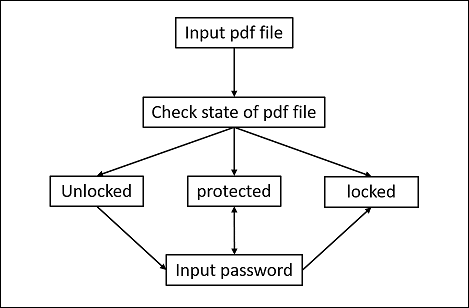

## PDF Locksmith

PDF Locksmith is a tool for protected, locked, unlocked pdf file.

## The Program flow

## GUI

## Feature

* Open: Using iTextSharp to process pdf file.
* Safe: Don't change the soure pdf file.
* Easy: A clear and simple windows form. Just put the pdf file and mouse down the button to protected, locked or unlocked.
* Fail-Safing: Can check the input file is pdf format.
